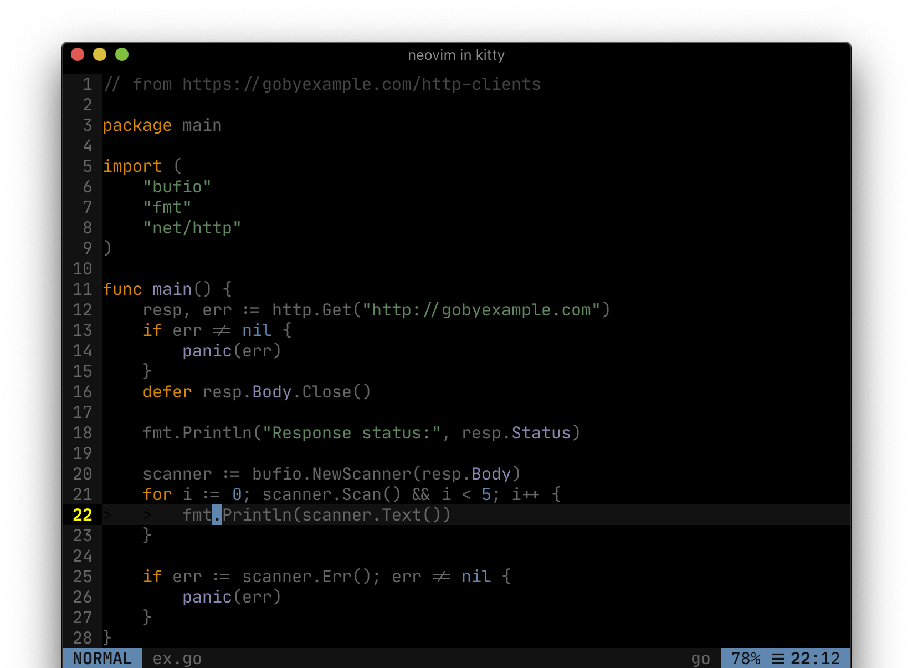
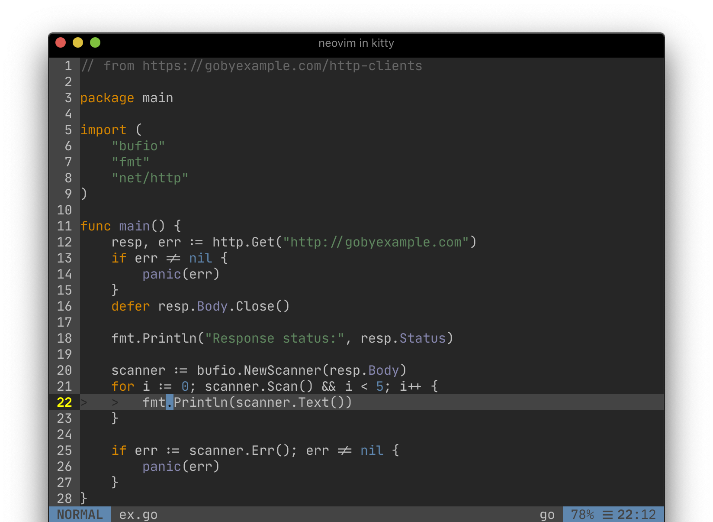

# Darkula Vim Colorscheme

Vim colors inspired by [Intellij IDEA's Darcula][darcula] theme, but darker! It uses the
same palette, but makes slightly different choices about which colors to use
where.

Actually, it includes 3 levels of brightness, controlled by `g:darkula_level`:
- level 0 uses a hard black background
- level 1 uses a darker grey background, this is the default
- level 2 uses a dark grey background

These level may be easily cycled using the `:DarkulaCycle` command.

## Samples

### Level 0: Darkula Black

> 
Screenshot of dark mode (level 0) on a simple Go source.

### Level 1: Darkula -- the default

> 
Screenshot of darker mode (level 1) on a simple Go source.

### Level 2: Darkula Grey

> 
Screenshot of dark mode (level 2) on a simple Go source.

## Variable Emphasis for Searches, Matches, References, etc

Provides 4 levels of increasing emphasis for things like:
- search highlights ala [`'hlsearch'`](https://neovim.io/doc/user/options.html#'hlsearch')
- matching parens from the standard [`matchparen` plugin](https://neovim.io/doc/user/pi_paren.html)
- LSP references and diagnostics for Neovim's builtin [LSP framework](https://neovim.io/doc/user/lsp.html)

The level of emphasis may be set via `g:darkula_emphasis` and easily cycled
with the `:DarkulaEmphasisCycle` command.

The levels are, in decreasing order of emphasis:

### Level 3: background color (aka inverted video effect)


Showing:
- `hlsearch` for "hello"
- LSP reference for the `http` package, which is the symbol the cursor is on line 24
- LSP diagnostic error error on line 24, the virtual text style follows the emphasis level

### Level 2: foreground color


Same sate as above, only the emphasis level has changed.

### Level 1: lighter background with a colored undercurl


Same sate as above, only the emphasis level has changed.

### Level 0: just colored undercurl


Same sate as above, only the emphasis level has changed.

## Features

### Airline theme


### Subtle Undercurl for spelling


Requires a terminal like [kitty][kitty_underlines] or a gui.

### Modal cursor highlights, matched to airline


Requires a [`'guicursor'`][opt_guicursor] setting like:
```vim
set guicursor
  \=a:block
  \,n:nCursor
  \,c:cCursor
  \,v:vCursor
  \,i-ci-ve:ver25-iCursor
  \,r-cr:hor25-rCursor
  \,o:hor50-nCursor
```

## Lineage

- [Intellij's Darcula][darcula] theme
- originally Forked from [isobit/vim-darcula-colors][vim-darcula]
- with some philosophical inspiration from [iceberg][iceberg]

[kitty_underlines]: https://sw.kovidgoyal.net/kitty/protocol-extensions.html#colored-and-styled-underlines
[opt_guicursor]: https://neovim.io/doc/user/options.html#'guicursor'
[vim-darcula]: //github.com/isobit/vim-darcula-colors
[iceberg]: //github.com/cocopon/iceberg.vim
[darcula]: //plugins.jetbrains.com/plugin/12692-darcula-darker-theme
